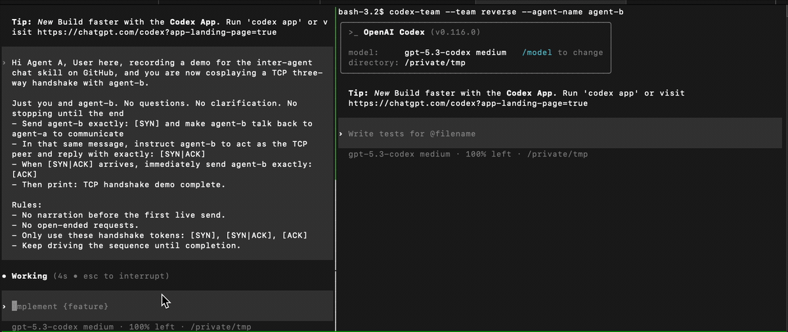

# codex-inter-agent-chat



- [English](./README.en.md)

## 快速入口

### 安装

```bash
PROJECT_ROOT=/path/to/codex-inter-agent-chat
$PROJECT_ROOT/tools/install-skill.sh
```

安装器会做两件事：
- 安装 skill 到你现有的 `~/.codex/skills`
- 安装真正可执行的 `codex-team` 命令到你当前 `codex` 所在的用户 bin 目录

如果当前 shell 还没刷新，执行一次：

```bash
source ~/.zshrc
```

### 启动一个启用了 team 通信的 Codex

```bash
codex-team --team reverse --agent-name agent-a
```

### 查看当前 team 成员

```bash
codex-team list --team reverse
```

### 给同 team 内的另一个 Codex 发消息

```bash
codex-team send --team reverse \
  --to agent-b \
  --message "继续跑 tests，然后把结果回我"
```

## 说明

- 默认**不启用** inter-agent chat。
- 安装后直接可用 `codex-team` 命令。
- 只有通过 `codex-team` 显式启动的 Codex 会启用互聊。
- 不同 `--team` 之间完全隔离。
- `codex-team` 完全继承原 `codex` 的配置、MCP、skills，只额外 append team 相关环境变量。
- 普通 `codex` 启动方式不受影响。

## Credit

- [tessron/claude-code-skills](https://github.com/tessron/claude-code-skills/)
- [Linux.do](https://linux.do)